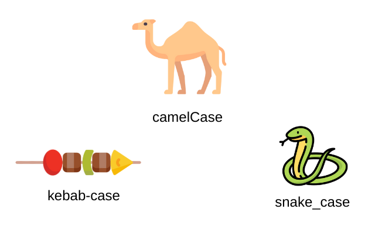

Be Something
===========
আমি Programming করতে চাই কারন এটা খুব ভালো লাগে এবং এটা আমার ছোট বেলা থেকেই অনেক ভালো লাগে আমি আমার ভূবিষ্যতে এটা পেশা হিসাবে নিচে চাই। Because I want earn more money for my family members with Gods I always do my best. 


সূচিপত্র
------------------
- [শুরুর কথা](#basic)
- [পরিবর্তনের কথা](#variable)

<a name="basic"></a>

# শুরুর কথা

### প্রোগ্রাম কী
প্রোগ্রাম বা ***program*** হচ্ছে সমস্যা সমাধানের জন্য কিছু আদেশ বা নির্দেশ এর সমষ্টি। যেমন : ভাত রান্নার প্রোগ্রাম, 

```
আদেশ ১। চাল পরিষ্কার ভালো করে পানি দিয়ে ধূয়া।
আদেশ ২। ভাতের পাত্র পরিষ্কার করা। 
আদেশ ৩। ভাতের পাত্রে চাল ও ২ কাপ পানি দেয়া।
আদেশ ৪। ভাতের পাত্রটি চুলার উপর বসানো।
আদেশ ৫। চুলায় আগুন দিয়ে ২০ মিনিট অপেক্ষা করা।
আদেশ ৬। ২০ মিনিট পর ভাতের পাত্র নামিয়ে পানি গুলো ছেকে পেলা। 
```

> ***program :***
    set of instraction which perform to solve a problem. 
    কিছু নির্দেশ বা আদেশ এর সমষ্টি যা কোনো সমস্যা সমাধান করে। 


### কম্পিউটার প্রোগ্রাম কী ?
***computer program*** হচ্ছে কম্পিউটার এর জন্য কোনো সমাধানের লক্ষ্যে programming language দিয়ে তৈরীকৃত আদেশ বা নির্দেশের সমষ্টি। যেমন : Hello, World! প্রিন্ট এর প্রোগ্রাম :

```c
#include <stdio.h>

int main(void){
    printf("Hello, World!");
    return 0;
}
``` 

> Computer Program : 
> 
>A computer program is a sequence of instructions that a computer can execute.

### প্রোগ্রামিং কী ?
কোনো সমস্যাকে ধাপে ধাপে সমাধান করাকে প্রোগ্রামিং বলে। 

### কম্পিউটার প্রোগ্রামিং কী ?
কোনো সমস্যা সমাধান করার নাম হচ্ছে প্রোগ্রামিং। ইংলিশে : 

> Computer programming is the process that professionals use to write code that instructs how a computer, application or software program performs. 

***প্রোগ্রামিং ও প্রোগ্রামের মাঝে পার্থক্য কী ?***
প্রোগ্রামিং হচ্ছে একটা প্রক্রিয়া। আর অন্য দিকে প্রোগ্রাম হচ্ছে কিছু নির্দেশ বা আদেশের সমষ্টি। 

> Programing is a process and Program is a set of instraction.

### অ্যালগোরিদম কী ? What is algorithm ?
কোন সমস্যা সমাধানের ধাপগুলোর লিখিত রূপকে Algorithm বলে।

> ***বইয়ের কঠিন ভাষাায় :*** কোনো সমস্যা সমাধানের যৌক্তিক ক্রমানুযায়ী ধাপসমূহের লিখিত রূপকে অ্যালগরিদম বলে।

> ***Algorithm :*** an algorithm is a set of instractions  for solving a problem and accomplishing a task.

### Flowchart কী ?
Algorithm কে চিত্রের মাধ্যমে প্রকাশ করা হলে তাকেই Flowchart বলে। নিচে একটি Nested if else flowchart এর উদাহরণ দেওয়া হলো : 


### Translator বা অনুবাদক কী ?
যার মাধ্যমে কোনো ভাষাকে আরেক ভাষায় অনুবাদ করা হয় তাকে অনুবাদক বা Translator বলে। কিন্তু কম্পিউটার সাইন্সে ভাষায় যে প্রোগ্রাম ব্যবহার করে high, low বা mid level programming language দিয়ে লিখিত প্রোগ্রামকে Machine language রূপান্তর করে তাকে Translator বলে।

> ***Translator :*** A Program translator translate a programming language to machine language.

### মেশিন ল্যাংগুয়েজ কী ? ( what is machine language? )
Machine Language হচ্ছে একপ্রকার language যেটি মেশিনে বুঝতে পারে। কম্পিউটার বাইনারি নাম্বার সিস্টেম কে মেশিন language হিসাবে use করে। 

> ***Machine Lanuage :***
Machine language includes binary digits (0 and 1), hexadecimal and octal decimal, which can be comprehended only by computers and cannot be deciphered by humans.

### Translator এর প্রকারবেদ ?
Translator সাদারনত ২ প্রকার ।

1. Compiler.
2. Interpreter.  

### Compiler কী ?
যে Translator সমগ্র প্রোগ্রাম ফাইলটাকে একসাথে Machine Lanuage অনুবাদ করে তাকে Compiler বলে।

> A translator which is read a whole program file and translate it machine language. 

### Interpreter 
যে Translator প্রোগ্রামকে একলাইন করে পড়ে Machine Language এ অনুবাদ করে তাকে Interpreter।

> A translator which is read a program file line by line and translate it machine language and execute it. 

### Programming Language কী ?
কম্পিউটার ব্যবহার করে যে সকল Lanuage এর সাহায্যে প্রোগ্রাম রচনা করা হয় তাকে Programming Language বলে।

> ***Programming Language :***A programming language is a vocabulary and set of grammatical rules for instructing a computer or computing device to perform specific tasks. 

### Programming Lanuage এর প্রকারবেদ :
Programming Language কে কয়েক ভাগে ভাগ করা যায়। নিচে তা দেওয়া হলো : 

***Translator এর উপর ভিত্তি করে প্রোগ্রামিং Language দুই প্রকার :***
1. Compiler Language.
2. Interpreter Language.

***প্রজন্ম উপর ভিত্তি করে Programming Language ৬ প্রকার।***
1. 1st Generation.
2. 2nd Generation.
3. 3rd Generation.
4. 4th Generation.
5. 5th Generation.
6. 6th Generation.

***Machine এর কতটা কাছে তার উপর ভিত্তি করে ৩ প্রকার তবে কিছু কিছু জায়গায় দুই প্রকরা।***
1. Low Level Programming Language.
2. Mid Level Programming Language.
3. High Level Programming Language. 

### Low Level Programming Language. 
যে Programming Lanuage দিয়ে প্রোগ্রাম লেখতে মেশিনের অনেক কিছু জানা লাগে এবং মেশিনের অনেক কাছ থেকে প্রোগ্রাম লেখতে হয় তাকে low level programming language বলে। এই গুলো হলো : Machine language, Assembly language.

### Mid Level Programming Language. 
যে Programming Language দিয়ে প্রোগ্রাম লেখতে মেশিনের তেমন কিছু জানার প্রোয়োজন হয় না। আবার প্রোগ্রাম লেখতে মেশিনের কাছাকাছি বিষয় গুলো নিয়ে লেখা যায় তাকে Mid Level Programming Language বলে। যেমন : C, C++, Go, Rust

### High Level Programming Language.
যে Programming Language দিয়ে প্রোগ্রাম লেখতে মেশিনের তেমন কিছু জানার প্রোয়োজন হয় না। আবার প্রোগ্রাম লেখতে মেশিনের কাছাকাছি বিষয় নিয়ে লেখা যায় না তাকে High Level Programming Language বলে। যেমন : JavaScript, Python, PHP, Kotlin, Java, Perl, R, Ruby, Swift ইত্যদি।

### What is file Extention and Folder ?
File হচ্ছে কম্পিউটারের মেমোরিতে কিছু জায়গা যা কিছু তথ্য বা Information ধারন করে রাখে। 


Folder হচ্ছে একধরনের Container যা কিছু ফাইল একসাথে করে রাখতে পারে এমনকি অন্যান্য Folder ও একসাথে করে রাখে। 

> ***File :*** A file is a container in a computer system for storing information. 
> 
> ***Folder :*** A folder, also called a directory, is a space used to store files and other folders on a computer.

***File Extention কী***

ফাইলের নামের শেষের দিকে ডট (.) দিয়ে যে শব্দ থাকে তাকে ঐ ফাইলের Extention বলে। File এর Extention ফাইলের ধরন বা Type বুঝায় । যেমন : .mp4 দিয়ে ভিডিও ফাইল, .py দিয়ে পাইথন ফাইল, .jpg দিয়ে  image ফাইল ইত্যদি বুঝায়। 


### Text Editor বা IDE কী ?
Text Editor হচ্ছে একধরনের প্রোগ্রাম যার সাহায্যে কোনো ফাইলের information পরিবর্তন করা যায়। 

IDE ( Intergrated Development Enviroment ) হচ্ছে একধরনের software যেটি একটি Application তৈরী করার জন্য অনেক গুলো প্রোয়োজনীয় Tool একসাথে করে রাখে যাথে সেগুলো একটি software ব্যবহার করেই Application তৈরী করা যায়। যেমন: পাইথনের IDE হচ্ছে pycharm, PHP এর IDE phpstrom, c ও c++ IDE হচ্ছে Codeblock ইত্যাদি। 

> ***Text Editor :*** system or program that allows a user to edit text.
> 
> ***IDE :*** An integrated development environment (IDE) is software for building applications that combines common developer tools into a single GUI.


### Print Hello World
পাইথনের ফাইল তৈরী করতে হবে ফাইলের নামের শেষে .py extention দিতে হয়। তার পর ফাইলটিকে IDE বা text editor এ খুলে প্রোগ্রাম লেখতে হয়। 

### পাইথনে কোনো কিছু প্রিন্ট করতে হলে :
পাইথনে কিছু প্রিন্ট করতে হলে print ব্যবহার করা লাগে। তা ব্যবহারের নিয়ম হলো :

***Program : 00.hello_world.py***
```py
print("Hello, World!");
```
এখানে print হচ্ছে পাইথনের built in function. যা সম্পর্কে পরে আলোচনা করা হবে।  প্রিন্ট এর পর ডাবল ফার্স্ট ব্রেকেটে যে value বা data দেওয়া হবে তা সবই নতুন লাইনে প্রিন্ট করা হবে। এখানে print এর পরে  "Hello, World!" দেওয়া হয়েছে। যা একটি string data । তাই Hello, World! প্রিন্ট হবে। নিচে আউটপুট টি দেওয়া হলো : 

```
Hello, World!
```

String value এর মত float বা int দিলে তাও প্রিন্ট হবে।  যেমন : 

***Program : 01.string_float_int.py***
```py
print("This is string");
print(33);
print(3.3);
```

***Output : 01.string_float_int.py***
```
This is string
33
3.3
```

প্রতিটা লাইনের শেষে সেমিকোলোন (;) দিয়ে বুঝায় লাইনটি এখানে শেষ হয়েছে। পাইথনে সেমিকোলোন না দিলে সমস্যা হয় না। কিন্তু সেমিকলোন দেওয়া Good Practice এর মাঝে পরে।  আবার প্রিন্ট এর মাঝে কিছু না দিলে লাইন ব্রেক প্রিন্ট করে। যেমন : 

***Program : 02.empty_string.py***
```py
print("Below the empty string .");
print();
print("Above the empty string.");
```

***Output : 02.empty_string.py***
```
Below the empty string.

Above the empty string.
```

## print এর আরেক ব্যবহার  : 
print এর মাঝে কমা (,) মাধ্যমে একাধিক value দিলে তা একলাইনে print করে দেখায়। 

***Program : print_oneline.py***
```py
print("string",32,3.2,"d");
```

***Output : print_oneline.py***
```
string 32 3.2 d
```

## comment 
কমেন্ট হচ্ছে প্রোগ্রামের ঐ সকল text যেগুলো compiler বা interpreter code execute করার সময় run করবে না, ignore করে চলে যাবে পরিবর্তী নির্দেশনায়। 

> In computer programming, a comment is a programmer-readable explanation or annotation in the source code of a computer program. 


comment দুই রকম হয়। 

1. Singleline Comment.
2. Multiline Comment.

নিচে python এ single ও multiline comment এর উদাহরণ দেওয়া হল : 

***Program : comment.py***
```py
# singleline comment

'''
multiline comment
here.
'''

"""
it is also 
another 
multiline comment 
example.
"""
```
<a name="variable"></a>
# পরিবর্তনের কথা
এই চাপ্টার টাতে আলোচনা করা হয়েছে :

- What is Variable ?
- What is nameError ?
- Variable Naming Rule ?
- Variable Naming Convention ?
- 4 Kind of Datatype.


## What is Variable ?
Variable হচ্ছে একপ্রকার চলক যার মান পরিবর্তনশীল। পাইথনে Variable একটি Box এর মত। যেখানে একেক সময় একেক রকম মান বা Data রাখা যায়। 

> Variables in a computer program are similler to "Buckets" or "Envelopes" where information can be maintained and referenced.

***Program : variable.py***
```py
variable_name = "value";
print(variable_name);
```

***Output : variable.py***
```
value
```

এখানে ***variable.py*** ফাইলে variable_name হচ্ছে variable এবং "value" হচ্ছে এই variable এর string type data বা value. যা print এর মাধ্যমে প্রিন্ট করানো হয়। Variable এর মান পরিবর্তনশীল। নিচে তা ব্যাখ্যা করা হলো : 

***Program : variable_changlable.py***
```py
name = "Hello";
print(name);
name = "Bye";
print(name);
```

***Output : variable_changlable.py.***
```
Hello
Bye
```

এখানে ***variable_changlable*** ফাইলে name নামে variable এর মান দুই বার পরিবর্তন করা হয়েছে এবং পরিবর্তন করার কারনে name variable এর দুই বার দুটি value output এসেছে।

### value Assign করা কী ?
variable এর মাঝে কোনো মান store করাকে সাধারানত value assign করা বুঝায়। 

### variable declare কী ?
প্রোগ্রামে নতুন ধরনের variable প্রথম বার নামকরন করাকে সাধারনত variable declare বলে। পাইথনে variable declare করার পাশাপাশি value assign করে দিতে হয়। নাহলে name error দিবে। 

## What is nameError ?
যদি প্রোগ্রামে এমন কোনো variable ব্যবহার বা access করার চেষ্টা করা হয় যার মান আগে থেকে define বা variable টিকে declare করা হয় নি তাহলে পাইথন name error throw করে। নিচে একটি প্রোগ্রামের সাহায্যে এর উদাহরণ দেখানো হলো : 

***Program : nameerror.py***
```py
print(hello);
```

***Output : nameerror.py***
```
Traceback (most recent call last):
  File "nameerror.py", line 1, in <module>
    print(hello);
NameError: name 'hello' is not defined
```

উপরের ***nameerror.py*** ফাইলে  hello নামে কোনো variable declare করা না থাকাই এটি output এর মাঝে name error throw করে।

## Variable naming rule ?
পাইথনে variable এর নামকরন এর সময় সব সময় কিছু নিয়ম follow করা লাগে নাহলে syntax error বা type error throw করে। নিচে variable এর নামকরন এর নিয়ম গুলো দেওয়া হলো : 

1. variable এর নামের মাঝে কখন space ব্যবহার করা যাবে না।
2. variable এর নাম কখন নাম্বার দিয়ে শুরু করা যাবে না। 
3. variable নামের মাঝে underscore (_) বাদে আর কোনো special character যেমন : %, #,$ ও @ ইত্যাদি ব্যবহার করা যাবে না। 
4. পাইথনে কিছু reserve keyword আছে । যেমন : for, if, else, while ইত্যাদি। এই গুলোর পাইথনে আলাদা অর্থ ব্যবহার হয়। এই রকম ৩৩ টা reserve keyword আছে। এই সকল keyword variable এর নাম হিসাবে ব্যবহার করা যাবে না। 

নিচে সকল নিয়ম ভুল এক প্রোগ্রাম ফাইলে তুলে ধরা হলো : 

***Program : wrong_variable_name.py***
```py
3name = 3; # wrong, start with number.
na me = 3; # wrong, use space in variable name.
n@me = 3; # wrong, use spcial character.
for = 3; # wrong, use reserve keyword.
```

উপরে ***wrong_variable_name.py*** ফাইলে সকল variable নামকরন ভুল।

## Variable Naming Convention.
Variable এর প্রচলিত নিয়ম রয়েছে। যাদেরকে variable naming convention বলে। এই নিয়ম মেনে variable নামকরন করতে হবে এমন কোনো কথা নেই। এই নিয়ম সাধারন অনুসরন করা হয় সৌন্দর্যের জন্য। এমন চারটি naming convertion হলো : 
1. snake_case
2. camelCase
3. PascalCase
4. kebab-case

এখানে একটি প্রোগ্রাম দেওয়া হলো যেখানে সকল naming convention দেওয়া হলো : 
***Program : naming_convention.py***
```py
this_result = 3; #snake_case
thisResult = 3; # camelCase
ThisResult = 3; # PascalCase

# below the kebab-case in comment out because it can not support in python
# kebab-case = 3;
```



## 4 Kind of Datatype ?
পাইথনে অনেক ধরনের datatype রয়েছে। Datatype হলো data ধরন বা type। নিচে ৪ ধরনের datatype ব্যাখ্যা করা হলো : 

1. Intager (int)
2. Float (float)
3. String (str)
4. Boolean (bool)

### Intager (int)
যে data বা value একটি পূর্নসংখ্যা হয় তাকে Intager ডাটা টাইপ বলে। python একে সংক্ষেপে int বলে। যেমন : 3, 2, 1, 24 ইত্যাদি।

### Float (float)
যে data বা value দশমিক সংখ্যা তাকে float বলে। python একে float এই বলে। যেমন : 3.14, 4.33, 33.22 ইত্যাদি।

### String (str)
পাইথনে single বা double Qoutation এর মাঝে যা লেখা হয় তাকে string বলা হয়। পাইথনে একে সংক্ষপে str বলে। যেমন : "string", "এটা একটা string", 'string', '33', '' ইত্যাদি। 

### Boolean (bool)
পাইথনে True এবং False দুটি শব্দ দিয়ে boolean datatype বুঝায়। একে পাইথনে সংক্ষেপে bool বলে। 

নিচের প্রোগ্রামে ৪ টি ডাটা টাইপের উদাহরণ দেওয়া হলো : 

***Program : four_datatype.py***
```py
number_int = 32; # int type
number_float = 3.141; # float type
string = "this is string"; # str type
boolean = True; # bool type

print(number_int);
print(number_float);
print(string);
print(boolean);
```

***Output : four_datatype.py***
```
32
3.141
this is string
True
```