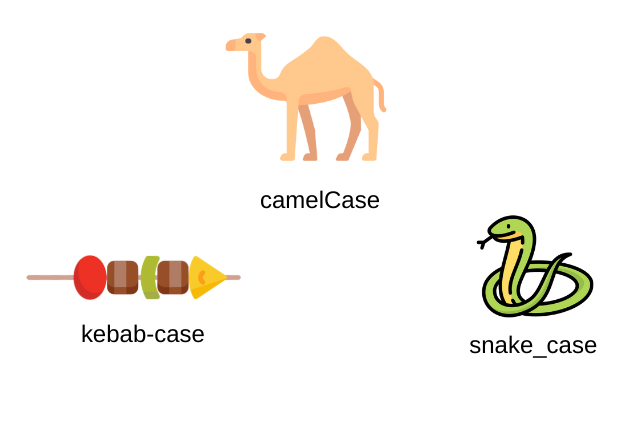

# পরিবর্তনের কথা
এই চাপ্টার টাতে আলোচনা করা হয়েছে :

- What is Variable ?
- What is nameError ?
- Variable Naming Rule ?
- Variable Naming Convention ?
- 4 Kind of Datatype.


## What is Variable ?
Variable হচ্ছে একপ্রকার চলক যার মান পরিবর্তনশীল। পাইথনে Variable একটি Box এর মত। যেখানে একেক সময় একেক রকম মান বা Data রাখা যায়। 

> Variables in a computer program are similler to "Buckets" or "Envelopes" where information can be maintained and referenced.

***Program : variable.py***
```py
variable_name = "value";
print(variable_name);
```

***Output : variable.py***
```
value
```

এখানে ***variable.py*** ফাইলে variable_name হচ্ছে variable এবং "value" হচ্ছে এই variable এর string type data বা value. যা print এর মাধ্যমে প্রিন্ট করানো হয়। Variable এর মান পরিবর্তনশীল। নিচে তা ব্যাখ্যা করা হলো : 

***Program : variable_changlable.py***
```py
name = "Hello";
print(name);
name = "Bye";
print(name);
```

***Output : variable_changlable.py.***
```
Hello
Bye
```

এখানে ***variable_changlable*** ফাইলে name নামে variable এর মান দুই বার পরিবর্তন করা হয়েছে এবং পরিবর্তন করার কারনে name variable এর দুই বার দুটি value output এসেছে।

### value Assign করা কী ?
variable এর মাঝে কোনো মান store করাকে সাধারানত value assign করা বুঝায়। 

### variable declare কী ?
প্রোগ্রামে নতুন ধরনের variable প্রথম বার নামকরন করাকে সাধারনত variable declare বলে। পাইথনে variable declare করার পাশাপাশি value assign করে দিতে হয়। নাহলে name error দিবে। 

## What is nameError ?
যদি প্রোগ্রামে এমন কোনো variable ব্যবহার বা access করার চেষ্টা করা হয় যার মান আগে থেকে define বা variable টিকে declare করা হয় নি তাহলে পাইথন name error throw করে। নিচে একটি প্রোগ্রামের সাহায্যে এর উদাহরণ দেখানো হলো : 

***Program : nameerror.py***
```py
print(hello);
```

***Output : nameerror.py***
```
Traceback (most recent call last):
  File "nameerror.py", line 1, in <module>
    print(hello);
NameError: name 'hello' is not defined
```

উপরের ***nameerror.py*** ফাইলে  hello নামে কোনো variable declare করা না থাকাই এটি output এর মাঝে name error throw করে।

## Variable naming rule ?
পাইথনে variable এর নামকরন এর সময় সব সময় কিছু নিয়ম follow করা লাগে নাহলে syntax error বা type error throw করে। নিচে variable এর নামকরন এর নিয়ম গুলো দেওয়া হলো : 

1. variable এর নামের মাঝে কখন space ব্যবহার করা যাবে না।
2. variable এর নাম কখন নাম্বার দিয়ে শুরু করা যাবে না। 
3. variable নামের মাঝে underscore (_) বাদে আর কোনো special character যেমন : %, #,$ ও @ ইত্যাদি ব্যবহার করা যাবে না। 
4. পাইথনে কিছু reserve keyword আছে । যেমন : for, if, else, while ইত্যাদি। এই গুলোর পাইথনে আলাদা অর্থ ব্যবহার হয়। এই রকম ৩৩ টা reserve keyword আছে। এই সকল keyword variable এর নাম হিসাবে ব্যবহার করা যাবে না। 

নিচে সকল নিয়ম ভুল এক প্রোগ্রাম ফাইলে তুলে ধরা হলো : 

***Program : wrong_variable_name.py***
```py
3name = 3; # wrong, start with number.
na me = 3; # wrong, use space in variable name.
n@me = 3; # wrong, use spcial character.
for = 3; # wrong, use reserve keyword.
```

উপরে ***wrong_variable_name.py*** ফাইলে সকল variable নামকরন ভুল।

## Variable Naming Convention.
Variable এর প্রচলিত নিয়ম রয়েছে। যাদেরকে variable naming convention বলে। এই নিয়ম মেনে variable নামকরন করতে হবে এমন কোনো কথা নেই। এই নিয়ম সাধারন অনুসরন করা হয় সৌন্দর্যের জন্য। এমন চারটি naming convertion হলো : 
1. snake_case
2. camelCase
3. PascalCase
4. kebab-case

এখানে একটি প্রোগ্রাম দেওয়া হলো যেখানে সকল naming convention দেওয়া হলো : 
***Program : naming_convention.py***
```py
this_result = 3; #snake_case
thisResult = 3; # camelCase
ThisResult = 3; # PascalCase

# below the kebab-case in comment out because it can not support in python
# kebab-case = 3;
```



## 4 Kind of Datatype ?
পাইথনে অনেক ধরনের datatype রয়েছে। Datatype হলো data ধরন বা type। নিচে ৪ ধরনের datatype ব্যাখ্যা করা হলো : 

1. Intager (int)
2. Float (float)
3. String (str)
4. Boolean (bool)

### Intager (int)
যে data বা value একটি পূর্নসংখ্যা হয় তাকে Intager ডাটা টাইপ বলে। python একে সংক্ষেপে int বলে। যেমন : 3, 2, 1, 24 ইত্যাদি।

### Float (float)
যে data বা value দশমিক সংখ্যা তাকে float বলে। python একে float এই বলে। যেমন : 3.14, 4.33, 33.22 ইত্যাদি।

### String (str)
পাইথনে single বা double Qoutation এর মাঝে যা লেখা হয় তাকে string বলা হয়। পাইথনে একে সংক্ষপে str বলে। যেমন : "string", "এটা একটা string", 'string', '33', '' ইত্যাদি। 

### Boolean (bool)
পাইথনে True এবং False দুটি শব্দ দিয়ে boolean datatype বুঝায়। একে পাইথনে সংক্ষেপে bool বলে। 

নিচের প্রোগ্রামে ৪ টি ডাটা টাইপের উদাহরণ দেওয়া হলো : 

***Program : four_datatype.py***
```py
number_int = 32; # int type
number_float = 3.141; # float type
string = "this is string"; # str type
boolean = True; # bool type

print(number_int);
print(number_float);
print(string);
print(boolean);
```

***Output : four_datatype.py***
```
32
3.141
this is string
True
```

<hr />


### [< Chapter 0](./../day_0/day_0.md) | [README](./../README.md) | [Chapter 2 >](./../day_2/day_2.md)